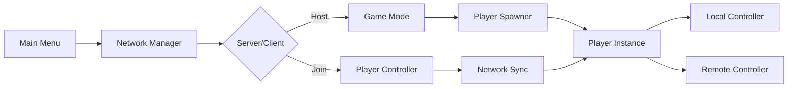

# 🎯 Godot Multiplayer FPS Template

<div align="center">


**A robust foundation for creating first-person shooter games with smooth multiplayer functionality**

*Complete networking solution with advanced player movement, synchronization, and matchmaking systems*

[🚀 Quick Start](#-quick-start) • [📋 Features](#-key-features) • [⚙️ Installation](#️-installation) • [🎮 Usage](#-usage) • [🤝 Contributing](#-contributing)

</div>

---

## 🌟 Overview

The **Godot Multiplayer FPS Template** is your gateway to creating competitive or cooperative multiplayer shooters. Built with performance and scalability in mind, this template provides everything you need to jumpstart your FPS project with professional-grade networking and smooth gameplay mechanics.

<div align="center">
  
  <p><em>Example screenshot</em></p>
</div>


## ✨ Key Features

### 🎮 **Core Gameplay**
<details>
<summary>Advanced movement and control systems</summary>

- **🏃 Advanced FPS Movement**: Sprinting, jumping, and air control with physics-based momentum
- **🖱️ Precision Mouse Look**: Adjustable sensitivity with smooth camera controls  
- **📷 Immersive Camera Effects**: Dynamic FOV changes,camera sway, and tilt effects
- **⚡ Responsive Controls**: Coyote time and jump buffering for fluid gameplay
- **🎯 Frame-Rate Independence**: Consistent movement regardless of FPS

</details>

### 🌐 **Multiplayer Networking**
<details>
<summary>Professional-grade networking architecture</summary>

- **🖥️ Dedicated Server Architecture**: Reliable and scalable server infrastructure
- **🔄 Smooth Synchronization**: Player interpolation and lag compensation
- **🎭 Player Management**: Seamless spawning/despawning system
- **🎪 Matchmaking System**: Automated lobby and session management
- **🔗 Scene Synchronization**: Automatic world state consistency

</details>

### ⚙️ **Technical Highlights**
<details>
<summary>Enterprise-level technical features</summary>

- **🏗️ Separated Controller Architecture**: Clean separation between local and remote players
- **🔮 Network Prediction**: Client-side prediction with server reconciliation
- **📦 Efficient Compression**: Optimized network data transmission
- **🎚️ Adaptive Interpolation**: Dynamic adjustment based on network conditions
- **🛡️ Error Handling**: Robust recovery and fallback systems

</details>

### 🖥️ **UI System**
<details>
<summary>Complete user interface suite</summary>

- **🏠 Main Menu**: Intuitive host/join functionality
- **⚙️ Settings Panel**: Customizable sensitivity, graphics, and audio options
- **📊 Connection Status**: Real-time network information display
- **💬 Feedback System**: User-friendly error messages and notifications

</details>

---

## 🛠️ Installation

### **Requirements**
-  **Godot Engine 4.4.1 or newer**
-  **Stable internet connection for multiplayer**

### **Quick Setup**

1. **Clone the Repository**
   ```bash
   git clone https://github.com/yourusername/godot-multiplayer-fps-template.git
   cd godot-multiplayer-fps-template
   ```

2. **Open in Godot**
   - Launch Godot Engine
   - Click "Import" and select the project folder
   - Wait for assets to import

3. **Run the Project**
   - Press `F5` or click the play button
   - Choose "Main" scene when prompted

---

## 🎮 Usage

### **Starting a Game**

#### 🖥️ **Host Server**
```gdscript
# Host a new multiplayer session
func host_game():
	multiplayer.peer_connected.connect(_on_player_connected)
	multiplayer.peer_disconnected.connect(_on_player_disconnected)
	
	var peer = ENetMultiplayerPeer.new()
	peer.create_server(PORT, MAX_PLAYERS)
	multiplayer.multiplayer_peer = peer
```

#### 🔌 **Join Server**
```gdscript
# Connect to an existing server
func join_game(address: String):
	var peer = ENetMultiplayerPeer.new()
	peer.create_client(address, PORT)
	multiplayer.multiplayer_peer = peer
```

### **Key Controls**
| Action | Key | Description |
|--------|-----|-------------|
| **Movement** | `WASD` | Move forward, left, back, right |
| **Sprint** | `Shift` | Increase movement speed |
| **Jump** | `Space` | Jump with momentum conservation |
| **Look** | `Mouse` | Camera rotation and aiming |
| **Settings** | `Esc` | Open settings menu |

---

## 🏗️ Architecture



### **Core Components**

- **`PlayerController`**: Handles input processing and movement logic
- **`NetworkManager`**: Manages connections and data synchronization  
- **`GameSession`**: Coordinates multiplayer game state
- **`UIManager`**: Controls menus and user interface
- **`SettingsManager`**: Handles player preferences and configuration

---

## 🎯 Customization

### **Movement Settings**
```gdscript
# Adjust in PlayerController.gd
@export var walk_speed: float = 5.0
@export var sprint_speed: float = 8.0
@export var jump_strength: float = 12.0
@export var mouse_sensitivity: float = 0.003
```

### **Network Configuration**
```gdscript
# Modify in NetworkManager.gd  
const PORT = 7000
const MAX_PLAYERS = 16
const TICK_RATE = 60
```

---

## 🤝 Contributing

We welcome contributions! Please see our [Contributing Guidelines](CONTRIBUTING.md) for details.

### **Development Workflow**
1. Fork the repository
2. Create a feature branch (`git checkout -b feature/amazing-feature`)
3. Commit your changes (`git commit -m 'Add amazing feature'`)
4. Push to the branch (`git push origin feature/amazing-feature`)
5. Open a Pull Request

---

## 📄 License

This project is licensed under the MIT License - see the [LICENSE](LICENSE) file for details.

---

## 🙏 Acknowledgments

- **Godot Engine** - The amazing open-source game engine
- **Community Contributors** - Thanks to everyone who helped improve this template
- **Beta Testers** - Your feedback made this template better

---

<div align="center">

### ⭐ **Star this repository if you found it helpful!** ⭐

**Made with ❤️ using Godot Engine**

[Report Bug](https://github.com/yourusername/godot-multiplayer-fps-template/issues) • [Request Feature](https://github.com/yourusername/godot-multiplayer-fps-template/issues) • [Join Discord](https://discord.gg/your-discord)

</div>
